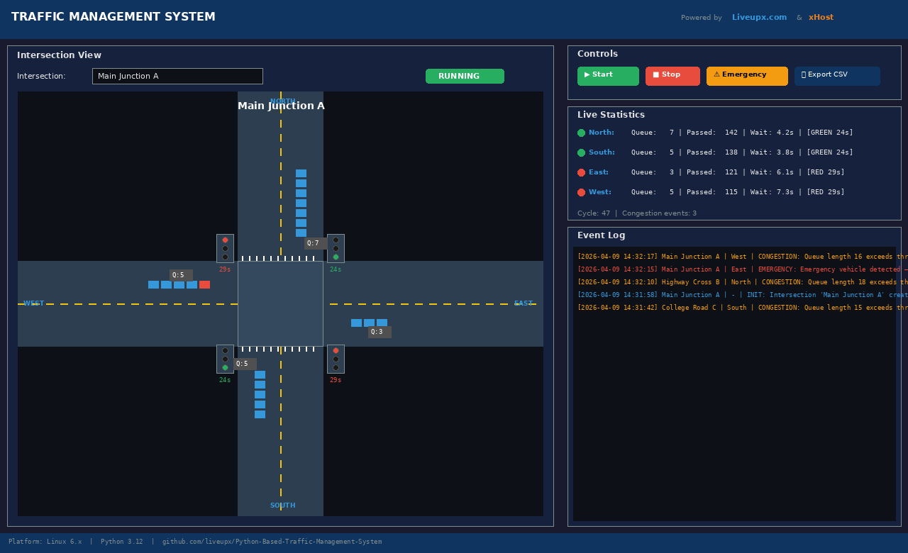
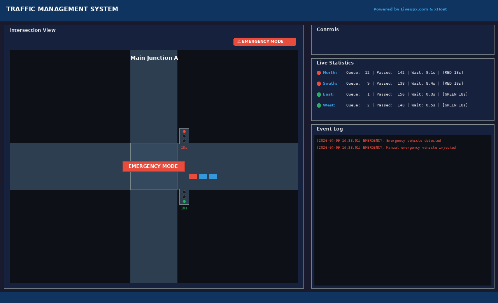
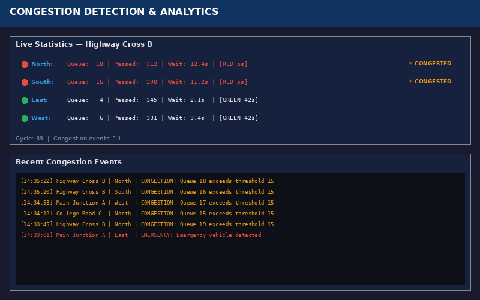
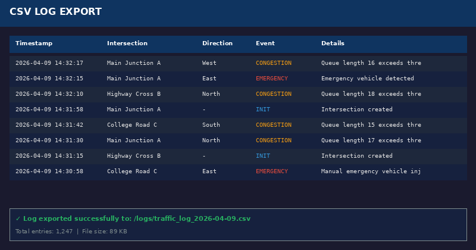
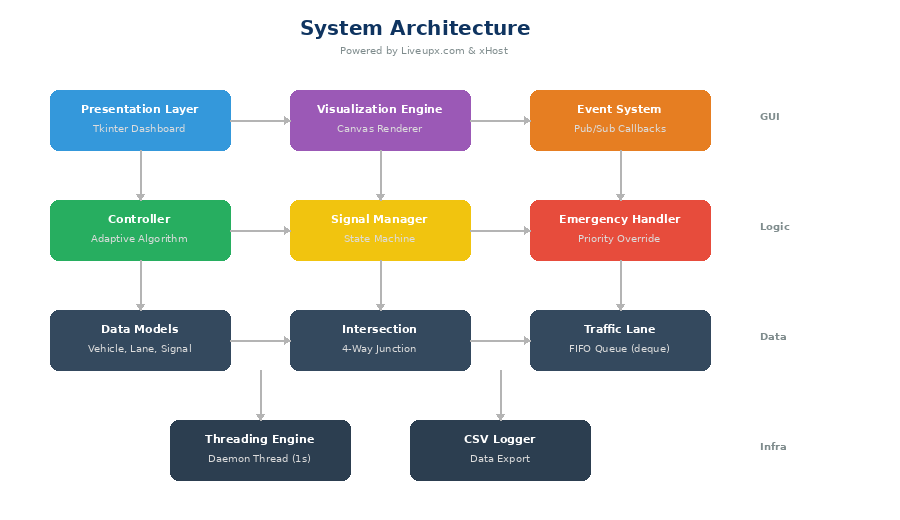

<div align="center">

# 🚦 Python-Based Traffic Management System

### An open-source, adaptive traffic signal control system with real-time GUI dashboard

[](https://python.org)
[](LICENSE)
[](#installation)
[](https://github.com/liveupx/Python-Based-Traffic-Management-System)

**Powered by [Liveupx.com](https://liveupx.com) & [xHost](https://xhost.com)**

*Built for students, developers, and traffic engineering enthusiasts*

---

[Features](#-features) · [Screenshots](#-screenshots) · [Quick Start](#-quick-start) · [Documentation](#-documentation) · [Contributing](#-contributing)

</div>

---

## 📖 About

This is a **fully functional, cross-platform traffic management system** built entirely in Python. It simulates real-world traffic flow at multiple intersections, uses **adaptive algorithms** to dynamically adjust signal timing, detects congestion, prioritizes emergency vehicles, and provides a beautiful **real-time GUI dashboard** — all with **zero external dependencies** (only Python standard library).

Perfect for:
- 🎓 **College students** — capstone projects, traffic engineering coursework, simulation studies
- 💻 **Python learners** — real-world application of OOP, threading, GUI development, algorithms
- 🔬 **Researchers** — extensible base for traffic optimization experiments and ML integration
- 🏗️ **Developers** — clean architecture patterns, event-driven design, adaptive algorithms

---

## ✨ Features

| Feature | Description |
|---------|-------------|
| 🔄 **Adaptive Signal Timing** | Dynamically adjusts green phase duration based on real-time queue density |
| 🏙️ **Multi-Intersection** | Manage multiple independent intersections simultaneously |
| 🚑 **Emergency Priority** | Automatic signal override when emergency vehicles are detected |
| 📊 **Live Statistics** | Real-time queue length, vehicles passed, average wait time per direction |
| ⚠️ **Congestion Detection** | Configurable threshold-based alerts with event logging |
| 🎨 **Dark Theme Dashboard** | Beautiful Tkinter GUI with intersection visualization |
| 📋 **CSV Export** | Export all traffic events for offline analysis in Excel/pandas |
| 🔌 **Event-Driven Architecture** | Pub/sub callbacks for easy extensibility |
| ⚙️ **Configurable** | All parameters tunable via `config.py` |
| 🖥️ **Cross-Platform** | Works on Windows, macOS, and Linux |

---

## 📸 Screenshots

### Main Dashboard
The primary interface showing real-time intersection visualization, traffic signals, vehicle queues, live statistics, and event log.



### Emergency Mode
When an emergency vehicle is detected, the system automatically overrides signals to provide priority passage.



### Congestion Detection
Real-time monitoring flags lanes that exceed the congestion threshold, with color-coded alerts.



### CSV Log Export
Export detailed traffic event logs for analysis in Excel, Google Sheets, or pandas.



### System Architecture
Clean layered architecture separating presentation, logic, data, and infrastructure.



---

## 🚀 Quick Start

### Prerequisites

- **Python 3.9+** (with Tkinter)
- No other dependencies required!

### Installation

<details>
<summary><b>🪟 Windows</b></summary>

```bash
# 1. Install Python from python.org (check "Add to PATH")
# 2. Clone the repo
git clone https://github.com/liveupx/Python-Based-Traffic-Management-System.git
cd Python-Based-Traffic-Management-System

# 3. Run
python traffic_management_system.py
```
</details>

<details>
<summary><b>🍎 macOS</b></summary>

```bash
# 1. Install Python (if not already installed)
brew install python-tk@3.12

# 2. Clone the repo
git clone https://github.com/liveupx/Python-Based-Traffic-Management-System.git
cd Python-Based-Traffic-Management-System

# 3. Run
python3 traffic_management_system.py
```
</details>

<details>
<summary><b>🐧 Linux (Ubuntu/Debian)</b></summary>

```bash
# 1. Install Python and Tkinter
sudo apt update
sudo apt install python3 python3-tk

# 2. Clone the repo
git clone https://github.com/liveupx/Python-Based-Traffic-Management-System.git
cd Python-Based-Traffic-Management-System

# 3. Run
python3 traffic_management_system.py
```
</details>

<details>
<summary><b>🐧 Linux (Fedora/RHEL)</b></summary>

```bash
# 1. Install Python and Tkinter
sudo dnf install python3 python3-tkinter

# 2. Clone the repo
git clone https://github.com/liveupx/Python-Based-Traffic-Management-System.git
cd Python-Based-Traffic-Management-System

# 3. Run
python3 traffic_management_system.py
```
</details>

<details>
<summary><b>🐧 Linux (Arch)</b></summary>

```bash
# 1. Install Python and Tkinter
sudo pacman -S python tk

# 2. Clone the repo
git clone https://github.com/liveupx/Python-Based-Traffic-Management-System.git
cd Python-Based-Traffic-Management-System

# 3. Run
python3 traffic_management_system.py
```
</details>

---

## 🎮 How to Use

1. **Launch** the application — the dashboard opens with 3 pre-configured intersections
2. **Click "▶ Start"** to begin the traffic simulation
3. **Watch** vehicles arrive, queue up, and flow through green signals
4. **Switch intersections** using the dropdown to monitor different junctions
5. **Trigger emergencies** with the "⚠ Emergency" button to test priority override
6. **Export data** using "📄 Export CSV" to save all events for analysis
7. **Stop** the simulation anytime with "■ Stop"

---

## ⚙️ Configuration

Edit `config.py` to customize the system:

```python
CONFIG = {
    "CONGESTION_THRESHOLD": 15,       # Queue length for congestion alert
    "MIN_GREEN_TIME": 10,             # Minimum green phase (seconds)
    "MAX_GREEN_TIME": 60,             # Maximum green phase (seconds)
    "EMERGENCY_PRIORITY_TIME": 20,    # Emergency override duration
    "VEHICLE_SPAWN_RATE": 0.55,       # Traffic density (0.0 - 1.0)
    "GUI_REFRESH_RATE": 500,          # Dashboard refresh (ms)
}
```

---

## 🏗️ Project Structure

```
Python-Based-Traffic-Management-System/
├── traffic_management_system.py   # Main application (530+ lines)
├── config.py                       # Configuration file
├── requirements.txt                # Dependencies (all optional)
├── LICENSE                         # MIT License
├── CONTRIBUTING.md                 # Contribution guidelines
├── README.md                       # This file
├── screenshots/                    # Application screenshots
│   ├── 01_main_dashboard.png
│   ├── 02_emergency_mode.png
│   ├── 03_congestion_detection.png
│   ├── 04_csv_export.png
│   └── 05_architecture.png
├── docs/
│   └── Traffic_Management_System_Guide.pdf  # Detailed PDF guide
├── tests/
│   └── test_controller.py          # Unit tests
└── logs/                           # Exported CSV logs (gitignored)
```

---

## 🧪 Running Tests

```bash
# With pytest
cd tests
python -m pytest test_controller.py -v

# Without pytest (built-in runner)
python tests/test_controller.py
```

---

## 📚 Documentation

A comprehensive **15-chapter PDF guide** is included in `docs/`:

| Chapter | Topic |
|---------|-------|
| 1 | Introduction & Overview |
| 2 | System Architecture & Design |
| 3 | Development Environment Setup (Windows, macOS, Linux) |
| 4 | Core Data Models & Structures |
| 5 | Adaptive Traffic Signal Controller |
| 6 | Emergency Vehicle Priority System |
| 7 | Congestion Detection & Analytics |
| 8 | GUI Dashboard (Tkinter) |
| 9 | Intersection Visualization Engine |
| 10 | Data Logging & CSV Export |
| 11 | Full Source Code Walkthrough |
| 12 | Testing & Validation |
| 13 | Deployment (all platforms) |
| 14 | Future Enhancements |
| 15 | Appendix & References |

📥 **[Download the PDF Guide](docs/Traffic_Management_System_Guide.pdf)**

---

## 🔮 Future Roadmap

- [ ] **OpenCV Integration** — Camera-based vehicle detection and counting
- [ ] **Machine Learning** — Reinforcement learning for signal optimization
- [ ] **Web Dashboard** — Flask/FastAPI + React frontend
- [ ] **Green Wave** — Coordinated timing across sequential intersections
- [ ] **Database** — SQLite/PostgreSQL for persistent logging
- [ ] **REST API** — Remote monitoring and control
- [ ] **YOLO Detection** — Real-time vehicle classification with deep learning

---

## 🤝 Contributing

Contributions are welcome! See [CONTRIBUTING.md](CONTRIBUTING.md) for guidelines.

```bash
# Fork → Clone → Branch → Code → Test → PR
git checkout -b feature/amazing-feature
git commit -m "Add: amazing feature"
git push origin feature/amazing-feature
```

---

## 📄 License

This project is licensed under the **MIT License** — see [LICENSE](LICENSE) for details.

---

## 🙏 Acknowledgments

- **[Liveupx.com](https://liveupx.com)** — Project development & documentation
- **[xHost](https://xhost.com)** — Infrastructure & hosting support
- The open-source Python community
- Traffic engineering researchers worldwide

---

<div align="center">

**⭐ Star this repo if you find it helpful!**

Made with ❤️ by [Liveupx.com](https://liveupx.com) & [xHost](https://xhost.com)

[Report Bug](https://github.com/liveupx/Python-Based-Traffic-Management-System/issues) · [Request Feature](https://github.com/liveupx/Python-Based-Traffic-Management-System/issues)

</div>
